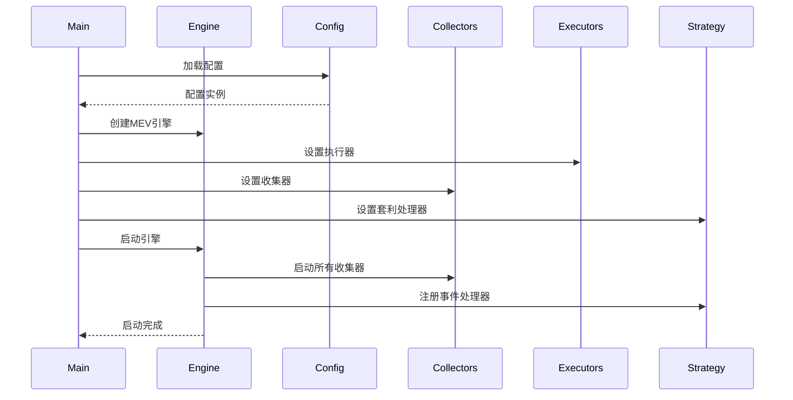
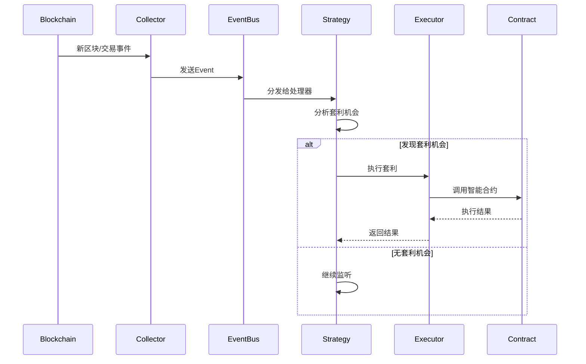

# AVAX MEV套利机器人技术文档

> **版本**: v1.0  
> **更新时间**: 2025年1月  
> **作者**: MEV Bot Team  

## 📋 目录
1. [项目概览](#1-项目概览)
2. [整体架构设计](#2-整体架构设计)
3. [模块详细解析](#3-模块详细解析)
4. [运行流程机制](#4-运行流程机制)
5. [配置系统详解](#5-配置系统详解)
6. [智能合约集成](#6-智能合约集成)
7. [待实现功能清单](#7-待实现功能清单)
8. [优化建议](#8-优化建议)
9. [部署和运行指南](#9-部署和运行指南)

---

## 1. 项目概览

### 1.1 项目简介
AVAX MEV套利机器人是一个专门针对Avalanche网络的MEV(Maximal Extractable Value)套利系统，能够自动发现和执行跨DEX的套利机会，通过监听链上交易和区块数据，实时计算套利路径并执行交易获取收益。

### 1.2 核心功能
- **实时监控**: 监听AVAX网络的区块和mempool事件
- **套利发现**: 使用BFS算法搜索多跳套利路径
- **智能执行**: 支持多种执行方式（模拟、直接、Flashbots、闪电贷）
- **风险控制**: 内置滑点保护、Gas优化、利润阈值控制
- **多DEX支持**: 集成Trader Joe、Pangolin、SushiSwap等主要DEX

### 1.3 技术栈
- **后端**: Rust + Tokio异步运行时
- **区块链交互**: ethers-rs
- **智能合约**: Solidity + Foundry
- **配置管理**: 环境变量 + TOML配置
- **日志系统**: log + env_logger

### 1.4 设计目标
- **高性能**: 毫秒级响应时间
- **高可用**: 24/7稳定运行
- **可扩展**: 模块化设计，易于扩展新DEX
- **安全**: 多层风控，资金安全保障

---

## 2. 整体架构设计

### 2.1 系统架构图

```
┌─────────────────────────────────────────────────────────┐
│                    AVAX Network                         │
│  ┌─────────────┐  ┌─────────────┐  ┌─────────────┐     │
│  │ Trader Joe  │  │  Pangolin   │  │ SushiSwap   │     │
│  └─────────────┘  └─────────────┘  └─────────────┘     │
└──────────────────┬─────────────────────────────────────┘
                   │ RPC/WebSocket
┌──────────────────▼─────────────────────────────────────┐
│                MEV Engine                               │
├─────────────────────────────────────────────────────────┤
│  Event Bus                                              │
├─────────────────────────────────────────────────────────┤
│ Data Collectors        │ Strategy Module                │
│ ┌─────────────────┐    │ ┌─────────────────────────┐    │
│ │ Block Collector │    │ │ Arbitrage Path Finder   │    │
│ │ Mempool Collect │    │ │ Opportunity Handler     │    │
│ └─────────────────┘    │ └─────────────────────────┘    │
├─────────────────────────────────────────────────────────┤
│ Executor Manager                                        │
│ ┌──────────┐ ┌──────────┐ ┌──────────┐ ┌─────────────┐  │
│ │   Mock   │ │ Mempool  │ │Flashbots │ │ Flash Loan  │  │
│ │Executor  │ │Executor  │ │Executor  │ │ Executor    │  │
│ └──────────┘ └──────────┘ └──────────┘ └─────────────┘  │
└─────────────────────────────────────────────────────────┘
                           │
┌──────────────────────────▼──────────────────────────────┐
│              Smart Contract Layer                       │
│  ┌─────────────────────────────────────────────────┐    │
│  │         ArbExecutorWithLotus.sol                │    │
│  │  ┌─────────────┐  ┌─────────────────────────┐   │    │
│  │  │ Lotus Router│  │   Flash Loan Provider   │   │    │
│  │  │ Integration │  │  (Aave V3 / Uniswap V2) │   │    │
│  │  └─────────────┘  └─────────────────────────┘   │    │
│  └─────────────────────────────────────────────────┘    │
└─────────────────────────────────────────────────────────┘
```

### 2.2 核心组件职责

#### 2.2.1 MEV Engine (核心引擎)
- **职责**: 统一协调所有组件，管理系统生命周期
- **功能**: 启动/停止控制、状态管理、统计信息收集
- **位置**: `src/core/engine.rs`

#### 2.2.2 Event Bus (事件总线)
- **职责**: 组件间事件通信的中枢
- **功能**: 事件分发、处理器管理、异步事件处理
- **位置**: `src/core/collectors/mod.rs`

#### 2.2.3 Data Collectors (数据收集器)
- **职责**: 从链上收集实时数据
- **功能**: WebSocket连接管理、事件解析、数据预处理
- **位置**: `src/core/collectors/`

#### 2.2.4 Strategy Module (策略模块)
- **职责**: 套利机会发现和路径计算
- **功能**: BFS路径搜索、利润计算、机会评估
- **位置**: `src/strategy/`

#### 2.2.5 Executor Manager (执行器管理)
- **职责**: 管理多种交易执行方式
- **功能**: 执行器选择、交易发送、结果处理
- **位置**: `src/core/executor/`

### 2.3 数据流向

```
Block/Mempool Events → Collectors → Event Bus → Strategy Module
                                         ↓
                              Arbitrage Opportunity
                                         ↓
                               Executor Manager
                                         ↓
                              Smart Contract Execution
                                         ↓
                               Transaction Result
```

---

## 3. 模块详细解析

### 3.1 核心引擎 (Core Engine)

#### 3.1.1 MevEngine结构
```rust
pub struct MevEngine {
    status: Arc<RwLock<BotStatus>>,           // 引擎状态
    statistics: Arc<RwLock<BotStatistics>>,   // 统计信息  
    event_bus: EventBus,                      // 事件总线
    collectors: Vec<Box<dyn Collector>>,      // 数据收集器
    shutdown_tx: Option<mpsc::Sender<()>>,    // 停止信号
    heartbeat_interval: Interval,             // 心跳间隔
    start_time: Option<std::time::Instant>,   // 启动时间
}
```

#### 3.1.2 生命周期管理
- `start()`: 启动所有收集器和事件循环
- `stop()`: 优雅停止所有组件
- `pause()/resume()`: 暂停/恢复操作
- `run_until_stopped()`: 运行直到收到停止信号

#### 3.1.3 状态监控
```rust
pub enum BotStatus {
    Starting,      // 启动中
    Running,       // 运行中  
    Paused,        // 暂停
    Stopped,       // 已停止
    Error(String), // 错误状态
}
```

### 3.2 数据收集器 (Data Collectors)

#### 3.2.1 Collector Trait
```rust
#[async_trait]
pub trait Collector: Send + Sync {
    fn name(&self) -> &str;
    async fn get_event_stream(&self) -> Result<EventStream>;
    async fn start(&mut self) -> Result<()>;
    async fn stop(&mut self) -> Result<()>;
}
```

#### 3.2.2 事件类型定义
```rust
pub enum Event {
    NewBlock {
        block_number: u64,
        block_hash: String,  
        timestamp: u64,
    },
    NewTransaction {
        hash: String,
        from: String,
        to: Option<String>,
        value: String,
        gas_price: String,
        data: Option<String>,
    },
    System(SystemEvent),
}
```

#### 3.2.3 待实现收集器

**BlockCollector** (`src/core/collectors/block.rs`)
```rust
// 需要实现的功能：
// - WebSocket连接到AVAX节点
// - 监听新区块事件  
// - 解析区块数据
// - 发送NewBlock事件
```

**MempoolCollector** (`src/core/collectors/mempool.rs`)
```rust  
// 需要实现的功能：
// - 监听pending交易
// - 过滤相关交易(DEX交互)
// - 解析交易数据
// - 发送NewTransaction事件
```

### 3.3 套利策略模块

#### 3.3.1 ArbitragePathFinder (路径搜索器)

**核心数据结构**:
```rust
pub struct ArbitragePathFinder {
    tokens: Arc<RwLock<HashMap<Address, Token>>>,                    // 代币缓存
    pools: Arc<RwLock<HashMap<Address, Pool>>>,                     // 池缓存  
    dex_pools: Arc<RwLock<HashMap<DexType, Vec<Address>>>>,        // DEX->池映射
    token_pair_pools: Arc<RwLock<HashMap<(Address, Address), Vec<Address>>>>, // 代币对->池映射
}
```

**路径搜索算法**:
- 使用BFS(广度优先搜索)算法
- 支持1-5跳套利路径
- 避免重复使用同一池子
- 实现环路检测回到起始代币

**利润计算**:
```rust
// 简化的恒定乘积公式
// amount_out = (amount_in * reserve_out) / (reserve_in + amount_in)
// 需要考虑：手续费、滑点、Gas成本
```

#### 3.3.2 ArbitrageHandler (机会处理器)
- 监听交易事件触发套利搜索
- 评估套利机会的可行性
- 调用执行器执行套利交易
- 记录执行结果和统计信息

### 3.4 执行器系统

#### 3.4.1 Executor Trait
```rust
#[async_trait]
pub trait Executor: Send + Sync {
    async fn execute_arbitrage(&self, path: &ArbitragePath) -> Result<ExecutionResult>;
    fn name(&self) -> &str;
    fn executor_type(&self) -> ExecutorType;
}
```

#### 3.4.2 执行器类型

**MockExecutor** (模拟执行器)
- 用于测试和开发
- 模拟交易执行过程
- 不发送真实交易

**MempoolExecutor** (内存池执行器) 
- 直接发送交易到内存池
- 适用于竞争不激烈的机会
- Gas价格动态调整

**FlashbotExecutor** (Flashbots执行器)
- 通过MEV-Boost发送bundle
- 避免抢跑和失败风险  
- 需要集成Flashbots API

**FlashLoanExecutor** (闪电贷执行器)
- 通过智能合约执行
- 支持无资金套利
- 原子性保证

#### 3.4.3 ExecutorManager
```rust
pub struct ExecutorManager {
    executors: Vec<Box<dyn Executor>>,
}

// 功能：
// - 管理多个执行器实例
// - 根据情况选择最优执行器
// - 执行结果统计和监控
```

---

## 4. 运行流程机制

### 4.1 启动初始化流程



### 4.2 事件处理循环



### 4.3 套利执行流程

#### 4.3.1 机会发现阶段
1. **事件触发**: 收到新交易或区块事件
2. **影响分析**: 分析对DEX池状态的影响
3. **路径搜索**: 使用BFS搜索套利路径
4. **利润计算**: 计算预期收益和成本
5. **可行性评估**: 检查是否满足最低利润阈值

#### 4.3.2 执行决策阶段  
1. **执行器选择**: 根据机会特点选择最优执行器
2. **Gas估算**: 估算交易Gas消耗
3. **风险评估**: 滑点、MEV竞争风险分析
4. **最终决策**: 确定是否执行

#### 4.3.3 交易执行阶段
1. **交易构造**: 构造交易参数
2. **签名发送**: 签名并发送交易
3. **状态监控**: 监控交易状态
4. **结果处理**: 处理执行结果并更新统计

---

## 5. 配置系统详解

### 5.1 环境变量配置

#### 5.1.1 必需配置
```bash
# 核心配置
PRIVATE_KEY=0x...                    # 执行账户私钥 (必需)
RPC_URL=https://api.avax.network/ext/bc/C/rpc  # RPC节点URL
WS_URL=wss://api.avax.network/ext/bc/C/ws      # WebSocket URL

# 基础参数
CHAIN_ID=43114                       # AVAX主网链ID
MIN_PROFIT_THRESHOLD=10000000000000000  # 最小利润阈值(wei) = 0.01 AVAX
MAX_GAS_PRICE_GWEI=50               # 最大Gas价格(gwei)
```

#### 5.1.2 可选配置
```bash
# 网络配置
USE_TESTNET=false                    # 是否使用测试网

# 策略参数
SLIPPAGE_TOLERANCE_BPS=100          # 滑点容忍度(基点) = 1%
MAX_HOPS=3                          # 最大跳数
SIMULATION_ENABLED=true             # 是否启用模拟

# 风控参数  
CONTINUE_ON_SIMULATION_FAILURE=false # 模拟失败时是否继续
MEMPOOL_DELAY_MS=100                # 内存池监听延迟

# 通知配置
TELEGRAM_BOT_TOKEN=                 # Telegram机器人token
TELEGRAM_CHAT_ID=                   # Telegram聊天ID
NOTIFY_ALL_TRANSACTIONS=false       # 是否通知所有交易
NOTIFY_SUCCESSFUL_ONLY=true         # 只通知成功的套利
MIN_NOTIFY_PROFIT=100000000000000000 # 最小通知利润阈值 = 0.1 AVAX
```

### 5.2 DEX配置

#### 5.2.1 Trader Joe配置
```rust
trader_joe: DexConfig {
    router_address: "0x60aE616a2155Ee3d9A68541Ba4544862310933d4",
    factory_address: "0x9Ad6C38BE94206cA50bb0d90783181662f0Cfa10", 
    fee_bps: 30,        // 0.3%手续费
    enabled: true,
}
```

#### 5.2.2 Pangolin配置  
```rust
pangolin: DexConfig {
    router_address: "0xE54Ca86531e17Ef3616d22Ca28b0D458b6C89106",
    factory_address: "0xefa94DE7a4656D787667C749f7E1223D71E9FD88",
    fee_bps: 30,        // 0.3%手续费  
    enabled: true,
}
```

#### 5.2.3 SushiSwap配置
```rust
sushiswap: DexConfig {
    router_address: "0x1b02dA8Cb0d097eB8D57A175b88c7D8b47997506", 
    factory_address: "0xc35DADB65012eC5796536bD9864eD8773aBc74C4",
    fee_bps: 30,        // 0.3%手续费
    enabled: true,
}
```

### 5.3 配置验证规则

#### 5.3.1 必需验证
- `PRIVATE_KEY`: 64字符或0x开头的66字符
- `RPC_URL`/`WS_URL`: 不能为空
- `MIN_PROFIT_THRESHOLD`: 必须大于0
- `MAX_HOPS`: 1-5之间

#### 5.3.2 逻辑验证
- 滑点容忍度不超过10%
- Telegram配置完整性检查
- 网络配置一致性检查

---

## 6. 智能合约集成

### 6.1 合约架构

#### 6.1.1 ArbExecutorWithLotus合约特性
- **多执行模式**: 自有资金、Aave V3闪电贷、Uniswap V2 flash swap
- **Lotus Router集成**: 统一的交易路由执行
- **安全机制**: 重入保护、权限控制、滑点保护
- **灵活性**: 支持多router、多闪电贷提供商

#### 6.1.2 核心功能接口

**自有资金执行**:
```solidity
struct ExecuteArgs {
    address routerAddr;        // Router地址
    address inputToken;        // 起始token  
    uint256 amountIn;         // 输入数量
    bytes plan;               // 路由计划
    address expectedOutToken; // 预期输出token
    uint256 minTotalOut;     // 最小输出
    address profitReceiver;   // 利润接收者
    bytes32 tag;             // 标记
}

function executeWithFunds(ExecuteArgs calldata args) external nonReentrant;
```

**闪电贷执行**:
```solidity
struct FlashArgs {
    address routerAddr;       // Router地址
    address asset;           // 借入资产
    uint256 amount;          // 借入数量  
    bytes plan;              // 路由计划
    address expectedOutToken; // 预期输出token
    uint256 minTotalOut;     // 最小输出
    address profitReceiver;   // 利润接收者
    bytes32 tag;             // 标记
}

function executeWithAaveFlash(FlashArgs calldata args) external nonReentrant;
```

### 6.2 部署流程

#### 6.2.1 前置准备
1. **安装Foundry**:
```bash
curl -L https://foundry.paradigm.xyz | bash
foundryup
```

2. **准备依赖**:
- Lotus Router合约地址
- Aave V3 Pool地址 (AVAX: `0x794a61358D6845594F94dc1DB02A252b5b4814aD`)
- 足够的AVAX用于部署

#### 6.2.2 合约部署步骤
```bash
# 1. 进入合约目录
cd solidity

# 2. 安装依赖
forge install

# 3. 编译合约
forge build

# 4. 部署合约 (主网)
forge create --rpc-url $RPC_URL \
  --private-key $PRIVATE_KEY \
  --constructor-args $LOTUS_ROUTER $AAVE_POOL $TREASURY \
  src/ArbExecutorWithLotus.sol:ArbExecutorWithLotus

# 5. 验证合约 (可选)
forge verify-contract \
  --chain-id 43114 \
  --constructor-args $(cast abi-encode "constructor(address,address,address)" $LOTUS_ROUTER $AAVE_POOL $TREASURY) \
  $CONTRACT_ADDRESS \
  src/ArbExecutorWithLotus.sol:ArbExecutorWithLotus
```

#### 6.2.3 合约初始化
```bash
# 设置允许的Router
cast send $CONTRACT_ADDRESS \
  "setRouter(address,bool)" \
  $LOTUS_ROUTER true \
  --rpc-url $RPC_URL \
  --private-key $PRIVATE_KEY

# 设置允许的交易对 (如果使用V2 flash swap)
cast send $CONTRACT_ADDRESS \
  "setAllowedPair(address,bool)" \
  $PAIR_ADDRESS true \
  --rpc-url $RPC_URL \
  --private-key $PRIVATE_KEY
```

### 6.3 Rust集成

#### 6.3.1 合约ABI生成
```bash
# 生成Rust绑定
forge bind --bindings-path ./bindings --root ./solidity --crate-name arbitrage_contracts
```

#### 6.3.2 合约调用示例
```rust
use ethers::prelude::*;
use arbitrage_contracts::ArbExecutorWithLotus;

// 连接合约
let contract = ArbExecutorWithLotus::new(contract_address, client);

// 执行套利 (自有资金)
let execute_args = ExecuteArgs {
    router_addr: lotus_router_address,
    input_token: token_address,
    amount_in: U256::from(amount),
    plan: plan_bytes,
    expected_out_token: output_token_address,
    min_total_out: min_amount,
    profit_receiver: receiver_address,
    tag: tag_bytes,
};

let tx = contract.execute_with_funds(execute_args).send().await?;
let receipt = tx.await?;
```

---

## 7. 待实现功能清单

### 7.1 高优先级 - 核心功能

#### 7.1.1 数据收集器实现 ⚠️ **关键**
**位置**: `src/core/collectors/`

**BlockCollector需要实现**:
```rust
pub struct BlockCollector {
    ws_client: Arc<Mutex<Option<WsClient>>>,
    ws_url: String,
    chain_id: u64,
    event_sender: mpsc::UnboundedSender<Event>,
}

// 核心方法:
impl BlockCollector {
    async fn connect_websocket(&mut self) -> Result<()>;
    async fn subscribe_new_blocks(&self) -> Result<()>;
    async fn parse_block_event(&self, block: Block) -> Event;
    async fn handle_disconnect(&mut self) -> Result<()>;
}
```

**MempoolCollector需要实现**:
```rust
pub struct MempoolCollector {
    ws_client: Arc<Mutex<Option<WsClient>>>,
    ws_url: String,
    chain_id: u64,
    event_sender: mpsc::UnboundedSender<Event>,
    min_gas_price: Option<U256>,
    contracts_only: bool,
    target_contracts: HashSet<Address>,
}

// 核心方法:
impl MempoolCollector {
    async fn subscribe_pending_transactions(&self) -> Result<()>;
    async fn filter_relevant_transactions(&self, tx: Transaction) -> bool;
    async fn parse_transaction_event(&self, tx: Transaction) -> Event;
}
```

#### 7.1.2 DEX数据同步模块 ⚠️ **关键**
**位置**: `src/strategy/dex_sync/` (需要新建)

**功能需求**:
```rust
pub struct DexDataSyncer {
    rpc_client: Arc<Provider<Http>>,
    pools: Arc<RwLock<HashMap<Address, Pool>>>,
    update_interval: Duration,
}

// 需要实现:
impl DexDataSyncer {
    async fn fetch_all_pools(&self) -> Result<Vec<Pool>>;
    async fn update_pool_reserves(&self, pool_address: Address) -> Result<()>;
    async fn sync_pool_data_periodically(&self);
    async fn handle_swap_event(&self, event: SwapEvent);
}
```

**池状态管理**:
```rust
#[derive(Debug, Clone)]
pub struct PoolState {
    pub pool: Pool,
    pub last_updated: Instant,
    pub block_number: u64,
}

pub struct PoolManager {
    pools: Arc<RwLock<HashMap<Address, PoolState>>>,
    stale_threshold: Duration, // 5分钟过期
}
```

#### 7.1.3 精确AMM计算 ⚠️ **关键**
**位置**: `src/strategy/amm/` (需要新建)

**Uniswap V2类型DEX**:
```rust
pub struct UniswapV2Calculator;

impl UniswapV2Calculator {
    // 考虑手续费的精确计算
    pub fn get_amount_out(
        amount_in: U256,
        reserve_in: U256,
        reserve_out: U256,
        fee_bps: u16, // 基点，如30 = 0.3%
    ) -> U256 {
        let amount_in_with_fee = amount_in * (10000 - fee_bps);
        let numerator = amount_in_with_fee * reserve_out;
        let denominator = reserve_in * 10000 + amount_in_with_fee;
        numerator / denominator
    }
    
    pub fn get_amount_in(
        amount_out: U256,
        reserve_in: U256,
        reserve_out: U256,
        fee_bps: u16,
    ) -> U256;
    
    pub fn calculate_price_impact(
        amount_in: U256,
        reserve_in: U256,
        reserve_out: U256,
    ) -> f64;
}
```

### 7.2 中等优先级 - 功能完善

#### 7.2.1 事件处理器完善
**位置**: `src/core/engine.rs`

**需要修复**:
```rust
// 当前被注释掉的EventHandler功能需要实现
impl MevEngine {
    pub fn add_handler(&mut self, handler: Arc<dyn EventHandler>);
    
    async fn start_event_processing(&mut self) -> Result<()> {
        // 启动事件处理循环
        // 连接collectors和handlers
    }
}
```

#### 7.2.2 执行器实现
**FlashbotExecutor** (`src/core/executor/flashbot.rs`):
```rust
// 需要完善Flashbots集成
pub struct FlashbotExecutor {
    flashbot_url: String,
    signing_key: SigningKey,
    bundle_executor: BundleExecutor,
}

impl FlashbotExecutor {
    async fn send_bundle(&self, bundle: Bundle) -> Result<BundleHash>;
    async fn simulate_bundle(&self, bundle: Bundle) -> Result<SimulationResult>;
}
```

**真实MempoolExecutor** (`src/core/executor/mempool.rs`):
```rust
// 需要完善实际的交易发送
impl MempoolExecutor {
    async fn estimate_gas(&self, path: &ArbitragePath) -> Result<U256>;
    async fn build_transaction(&self, path: &ArbitragePath) -> Result<TypedTransaction>;
    async fn send_transaction(&self, tx: TypedTransaction) -> Result<PendingTransaction>;
    async fn wait_for_confirmation(&self, tx_hash: H256) -> Result<TransactionReceipt>;
}
```

#### 7.2.3 通知系统实现
**位置**: `src/utils/notification.rs` (需要新建)

```rust
pub struct TelegramNotifier {
    bot_token: String,
    chat_id: i64,
    client: reqwest::Client,
}

impl TelegramNotifier {
    pub async fn send_arbitrage_success(&self, result: &ExecutionResult);
    pub async fn send_arbitrage_failure(&self, error: &str);
    pub async fn send_daily_summary(&self, stats: &BotStatistics);
}
```

### 7.3 低优先级 - 增强功能

#### 7.3.1 监控和指标
**位置**: `src/utils/monitoring.rs` (需要新建)

```rust
pub struct MetricsCollector {
    pub opportunities_found: AtomicU64,
    pub successful_arbitrages: AtomicU64,
    pub failed_arbitrages: AtomicU64,
    pub total_profit: Arc<Mutex<U256>>,
    pub total_gas_spent: Arc<Mutex<U256>>,
}
```

#### 7.3.2 配置热重载
```rust
pub struct ConfigWatcher {
    config_file_path: PathBuf,
    config: Arc<RwLock<AppConfig>>,
}

impl ConfigWatcher {
    pub async fn watch_for_changes(&self);
    pub async fn reload_config(&self) -> Result<()>;
}
```

---

## 8. 优化建议

### 8.1 性能优化

#### 8.1.1 并发处理优化
```rust
// 使用tokio::spawn并发处理多个套利机会
async fn process_opportunities_concurrently(
    opportunities: Vec<ArbitrageOpportunity>
) -> Vec<ExecutionResult> {
    let tasks: Vec<_> = opportunities
        .into_iter()
        .map(|opp| tokio::spawn(process_single_opportunity(opp)))
        .collect();
    
    let results = futures::future::join_all(tasks).await;
    results.into_iter().filter_map(|r| r.ok()).collect()
}
```

#### 8.1.2 缓存策略优化
```rust
use moka::future::Cache;

pub struct CacheManager {
    pool_cache: Cache<Address, Pool>,
    path_cache: Cache<PathCacheKey, Vec<ArbitragePath>>,
    price_cache: Cache<(Address, Address), f64>,
}

impl CacheManager {
    pub async fn get_or_fetch_pool(&self, address: Address) -> Result<Pool>;
    pub async fn invalidate_pool(&self, address: Address);
}
```

#### 8.1.3 批量RPC调用
```rust
use ethers::providers::Multicall;

pub struct BatchRpcCaller {
    multicall: Multicall<Provider<Http>>,
}

impl BatchRpcCaller {
    pub async fn batch_get_reserves(&self, pools: &[Address]) -> Result<Vec<(U256, U256)>>;
    pub async fn batch_get_balances(&self, tokens: &[Address], account: Address) -> Result<Vec<U256>>;
}
```

### 8.2 安全性增强

#### 8.2.1 私有内存池集成
```rust
pub struct PrivateMempoolExecutor {
    private_pool_url: String,
    bundle_builder: BundleBuilder,
}

// 集成如Eden Network, BloXroute等私有内存池服务
impl PrivateMempoolExecutor {
    async fn send_to_private_pool(&self, bundle: Bundle) -> Result<()>;
}
```

#### 8.2.2 滑点保护增强
```rust
pub struct SlippageProtector {
    max_slippage_bps: u16,
    dynamic_adjustment: bool,
}

impl SlippageProtector {
    pub fn calculate_min_amount_out(&self, path: &ArbitragePath, market_impact: f64) -> U256;
    pub fn should_abort_due_to_slippage(&self, expected: U256, actual: U256) -> bool;
}
```

#### 8.2.3 资金安全机制
```rust
pub struct FundProtector {
    max_single_trade: U256,
    max_daily_loss: U256,
    emergency_stop: Arc<AtomicBool>,
}

impl FundProtector {
    pub fn validate_trade_amount(&self, amount: U256) -> Result<()>;
    pub fn check_daily_loss(&self) -> Result<()>;
    pub fn trigger_emergency_stop(&self);
}
```

### 8.3 架构扩展性

#### 8.3.1 插件化DEX支持
```rust
pub trait DexAdapter: Send + Sync {
    fn name(&self) -> &str;
    async fn get_pools(&self) -> Result<Vec<Pool>>;
    async fn calculate_swap_output(&self, input: SwapInput) -> Result<SwapOutput>;
    async fn build_swap_call(&self, swap: &SwapParams) -> Result<CallData>;
}

pub struct DexRegistry {
    adapters: HashMap<DexType, Box<dyn DexAdapter>>,
}
```

#### 8.3.2 策略框架
```rust
pub trait Strategy: Send + Sync {
    async fn analyze_opportunity(&self, event: &Event) -> Result<Vec<ArbitrageOpportunity>>;
    async fn should_execute(&self, opportunity: &ArbitrageOpportunity) -> bool;
    fn priority(&self) -> u8;
}

pub struct StrategyManager {
    strategies: Vec<Box<dyn Strategy>>,
}
```

---

## 9. 部署和运行指南

### 9.1 环境准备

#### 9.1.1 系统要求
- **操作系统**: Linux (Ubuntu 20.04+推荐) / macOS
- **内存**: 最小4GB，推荐8GB+
- **CPU**: 多核处理器，推荐4核+
- **存储**: 至少10GB可用空间
- **网络**: 稳定的互联网连接，低延迟到AVAX节点

#### 9.1.2 依赖安装
```bash
# 安装Rust
curl --proto '=https' --tlsv1.2 -sSf https://sh.rustup.rs | sh
source ~/.cargo/env

# 安装Foundry (用于合约部署)
curl -L https://foundry.paradigm.xyz | bash
foundryup

# 安装其他工具
sudo apt update
sudo apt install -y build-essential pkg-config libssl-dev
```

### 9.2 项目设置

#### 9.2.1 克隆和构建
```bash
# 克隆项目
git clone https://github.com/your-repo/arbitrage-bot.git
cd arbitrage-bot

# 构建项目
cargo build --release

# 运行测试
cargo test
```

#### 9.2.2 配置文件设置
创建`.env`文件:
```bash
# 复制示例配置
cp .env.example .env

# 编辑配置文件
vim .env
```

必需配置项:
```bash
PRIVATE_KEY=your_private_key_here
RPC_URL=https://api.avax.network/ext/bc/C/rpc  
WS_URL=wss://api.avax.network/ext/bc/C/ws
MIN_PROFIT_THRESHOLD=10000000000000000  # 0.01 AVAX
```

### 9.3 合约部署

#### 9.3.1 测试网部署
```bash
# 使用Fuji测试网
export RPC_URL=https://api.avax-test.network/ext/bc/C/rpc
export CHAIN_ID=43113

# 部署合约
cd solidity
forge create --rpc-url $RPC_URL \
  --private-key $PRIVATE_KEY \
  --constructor-args $LOTUS_ROUTER $AAVE_POOL $TREASURY \
  src/ArbExecutorWithLotus.sol:ArbExecutorWithLotus
```

#### 9.3.2 主网部署
```bash
# 确保有足够的AVAX用于gas
# 使用主网RPC
export RPC_URL=https://api.avax.network/ext/bc/C/rpc
export CHAIN_ID=43114

# 部署到主网 (谨慎操作)
forge create --rpc-url $RPC_URL \
  --private-key $PRIVATE_KEY \
  --constructor-args $LOTUS_ROUTER $AAVE_POOL $TREASURY \
  src/ArbExecutorWithLotus.sol:ArbExecutorWithLotus
```

### 9.4 运行机器人

#### 9.4.1 开发模式
```bash
# 设置日志级别
export RUST_LOG=info

# 运行开发版本
cargo run
```

#### 9.4.2 生产模式
```bash
# 编译优化版本
cargo build --release

# 使用systemd管理服务
sudo tee /etc/systemd/system/arbitrage-bot.service > /dev/null <<EOF
[Unit]
Description=AVAX Arbitrage Bot
After=network.target

[Service]
Type=simple
User=arbitrage
WorkingDirectory=/home/arbitrage/arbitrage-bot
Environment=RUST_LOG=info
ExecStart=/home/arbitrage/arbitrage-bot/target/release/arbitrage-bot
Restart=always
RestartSec=10

[Install]
WantedBy=multi-user.target
EOF

# 启动服务
sudo systemctl daemon-reload
sudo systemctl enable arbitrage-bot
sudo systemctl start arbitrage-bot
```

#### 9.4.3 Docker部署
```dockerfile
FROM rust:1.75 as builder
WORKDIR /usr/src/app
COPY . .
RUN cargo build --release

FROM debian:bookworm-slim
RUN apt-get update && apt-get install -y ca-certificates && rm -rf /var/lib/apt/lists/*
COPY --from=builder /usr/src/app/target/release/arbitrage-bot /usr/local/bin/arbitrage-bot
CMD ["arbitrage-bot"]
```

```bash
# 构建和运行Docker镜像
docker build -t arbitrage-bot .
docker run -d --name arbitrage-bot --env-file .env arbitrage-bot
```

### 9.5 监控和维护

#### 9.5.1 日志监控
```bash
# 查看实时日志
journalctl -u arbitrage-bot -f

# 查看错误日志
journalctl -u arbitrage-bot -p err

# 日志轮转设置
sudo logrotate /etc/logrotate.d/arbitrage-bot
```

#### 9.5.2 性能监控
```bash
# 监控系统资源
htop
iotop
netstat -i

# 监控进程
ps aux | grep arbitrage-bot
```

#### 9.5.3 健康检查
```bash
# 创建健康检查脚本
cat > health_check.sh << 'EOF'
#!/bin/bash
if ! systemctl is-active --quiet arbitrage-bot; then
    echo "Bot is not running, restarting..."
    systemctl restart arbitrage-bot
fi
EOF

# 添加到crontab (每5分钟检查一次)
*/5 * * * * /path/to/health_check.sh
```

---

## 📊 总结

这份技术文档涵盖了AVAX MEV套利机器人的完整技术架构、实现细节和部署指南。主要包含：

### ✅ 已实现部分
- 完整的系统架构设计
- 核心引擎和事件总线
- 基础的套利路径搜索算法  
- 多种执行器框架
- 功能完整的智能合约
- 配置管理系统

### ⚠️ 待实现部分 (优先级排序)
1. **高优先级**: 数据收集器实现、DEX数据同步、精确AMM计算
2. **中优先级**: 事件处理完善、执行器实现、通知系统
3. **低优先级**: 监控系统、配置热重载、性能优化

### 🚀 后续规划
建议按照优先级顺序逐步实现缺失功能，先确保核心套利功能正常工作，再逐步添加监控、通知等增强功能。

整个机器人的核心设计思路是模块化、可扩展的，可以根据实际需求调整和优化各个组件。
