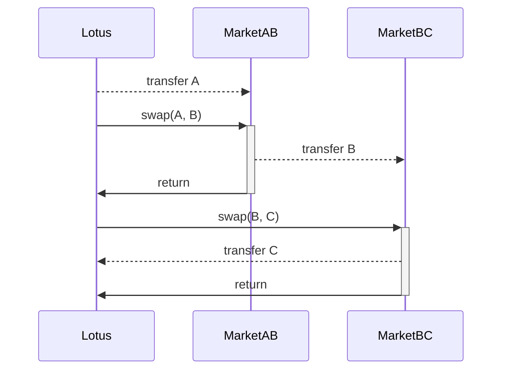
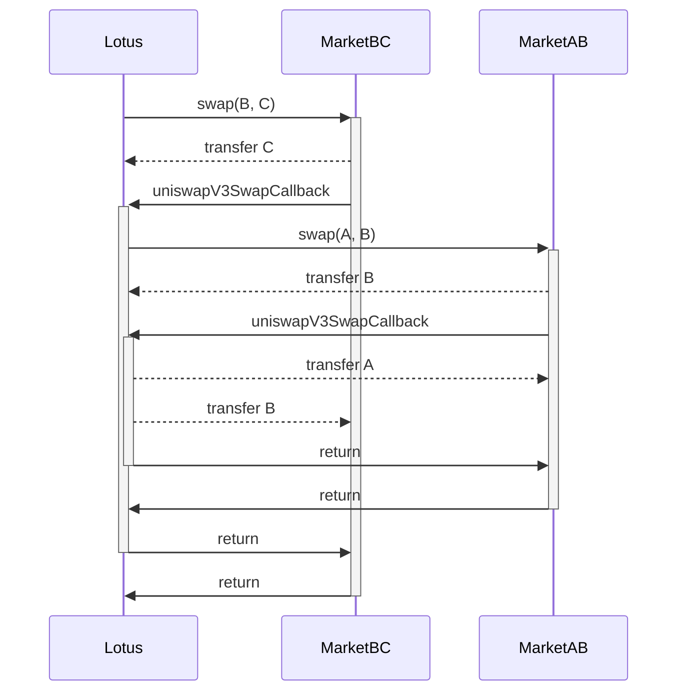
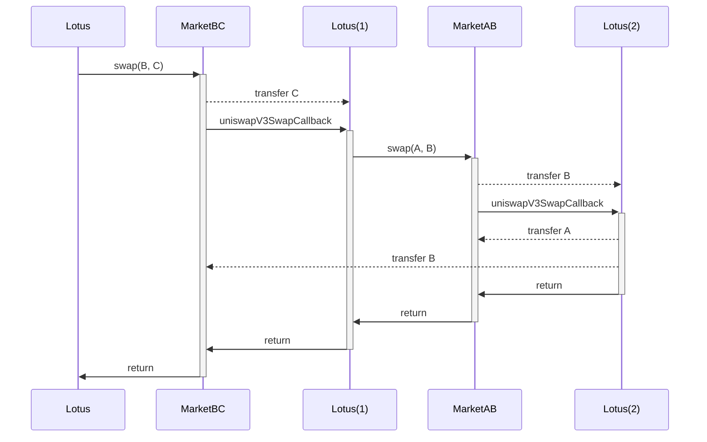
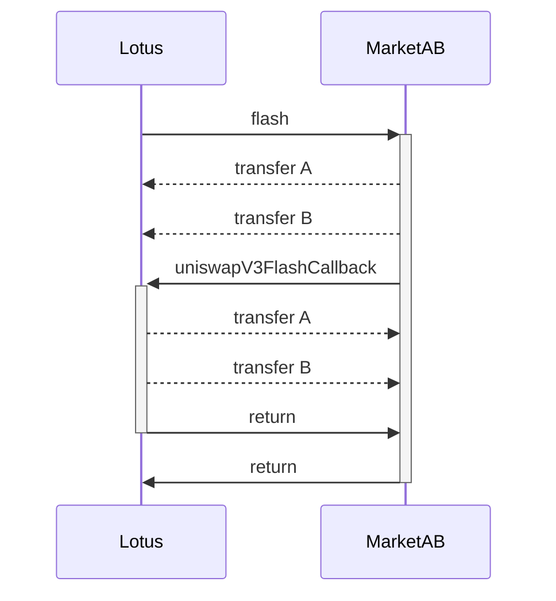
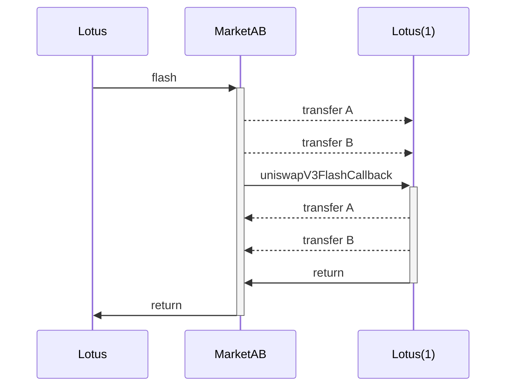

# Lotus Router

The Lotus Router is an embedded virtual machine which treats instructions as
DeFi protocol interactions, primarily automated market marker protocols. It does
not take fees, it does not extract rent, it is not upgradeable, it is
permissionless, it is free and open source software. It bears the AGPL-3.0
copy-left license.

Built with experience from the frontier, with solidarity for developers of
sovereignity, and with a love for democratization of knowledge and software.

> Work In Progress, Do Not Use Yet

## Why?

Searchers and Solvers alike employ people like us to repeatedly build the state
of the art in router technology.

Searchers and Solvers alike justify secrecy with "alpha decay" and other pseudo-
academic terminology in order to hoard the cutting edge and the capital which
comes with it.

<br/>

We grow tired of building the same software again and again.

We grow tired of signing NDA after NDA.

We grow tired of repeating ourselves.

<br/>

So we the Researchers and Developers write this software with the intent to
democratize the cutting edge of router technology.

So we the Researchers and Developers write this software with the intent to
liberate the secrets of a parasitic industry.

So we the Researchers and Developers write this software with the intent to
expose the elegant simplicity which hides behind bytecode obfuscators and the
mysticism of our local elites.

## Disclaimer

Multiple organizations may contend that this technology was stolen, or that it
is the subject of trade secrets.

However, we the Researchers and Developers formally declare this software is
developed explicitly on our own time, on our own hardware, with our own
software, and with our own knowledge accumulated from both educational resources
and through our understanding and interpretation of the bytecode which exists on
the public blockchains.

## Implementation Details

Batchable actions:

- [x] Uniswap V2 Swap
- [x] Uniswap V3 Swap
- [x] Uniswap V3 Flash
- [x] ERC20 Transfer
- [x] ERC20 TransferFrom
- [x] ERC721 TransferFrom
- [x] ERC6909 Transfer
- [x] ERC6909 TransferFrom
- [x] Wrap WETH
- [x] Unwrap WETH
- [x] Dynamic Contract Call

Other features:

- [x] Unconventional Encoder/Decoder (inspired by bigbrainchad.eth)
- [ ] Transient storage call stack constraints (inspired by bigbrainchad.eth)
- [x] Virtual Machine Style Architecture (inspired by, yes, bigbrainchad.eth)

### Call Diagrams

#### Uniswap V2 Chaining

Chaining Uniswap V2 markets entails iteratively calling pairs, forwarding the
output of one swap into the next pair.

- `Lotus` transfers `TokenA` to `MarketAB`
- `Lotus` calls `swap` on `MarketAB`
  - `MarketAB` swaps and transfers `TokenB` to `MarketBC`
- `Lotus` calls `swap` on `MarketBC`
  - `MarketBC` swaps and transfers `TokenC` to `Lotus`



#### Uniswap V3 Chaining

Chaining Uniswap V3 markets entails recursively calling pools, settling each
market in its respective callback to the router.

While it is possible to simplify encoding control flow by calling iteratively,
recursion saves `O(n)` calls.

- `Lotus` calls `swap` on `MarketBC`
  - `MarketBC` transfers `TokenC` to `Lotus`
  - `MarketBC` calls back into `Lotus` with `uniswapV3Callback`
    - `Lotus` calls `swap` on `MarketAB`
      - `MarketAB` transfers `TokenB` to `Lotus`
      - `MarketAB` calls back into `Lotus` with `uniswapV3Callback`
        - `Lotus` transfers `TokenA` to `MarketAB`, settling the balances
        - `Lotus` transfers `TokenB` to `MarketBC`, settling the balances



A broken out, more intuitive diagram breaks the `Lotus` router out into its
three independent call contexts.



#### Uniswap V3 Flash

- `Lotus` calls `flash` on `MarketAB`
  - `MarketAB` transfers `TokenA` to `Lotus`, if any was requested
  - `MarketAB` transfers `TokenB` to `Lotus`, if any was requested
  - `MarketAB` back into `Lotus` with `uniswapV3FlashCallback`
    - `Lotus` transfers `TokenA` to `MarketAB`, if any was taken
    - `Lotus` transfers `TokenB` to `MarketAB`, if any was taken



A broken out, more intuitive diagram breaks the `Lotus` router out into its
two independent call contexts.



### Encoding Scheme

The encoding scheme reduces all statically sized values to their smallest size,
in bytes, and prefixes them with an 8 bit integer indicating the truncated byte
length. All dynamically sized values are prefixed with only a 32 bit length of
the data. There are no offsets in this encoding scheme, so objects are parsed
in order with a pointer incrementing continuously while parsing.

```ebnf
<action> ::=
  | ("0x00")
  | ("0x01" . <swap_uni_v2>)
  | ("0x02" . <swap_uni_v3>)
  | ("0x03" . <flash_uni_v3>)
  | ("0x04" . <transfer_erc20>)
  | ("0x05" . <transfer_from_erc20>)
  | ("0x06" . <transfer_from_erc721>)
  | ("0x07" . <transfer_erc6909>)
  | ("0x08" . <transfer_from_erc6909>)
  | ("0x09" . <deposit_weth>)
  | ("0x0a" . <withdraw_weth>)
  | ("0x0b" . <dyn_call>) ;

<swap_uni_v2> ::=
  . <can_fail_bool>
  . <pair_byte_len_u8>
  . <pair>
  . <amount0_out_byte_len_u8>
  . <amount0_out>
  . <amount1_out_byte_len_u8>
  . <amount1_out>
  . <to_out_byte_len_u8>
  . <to_out>
  . <data_byte_len_u32>
  . <data> ;

<swap_uni_v3> ::=
  . <can_fail_bool>
  . <pool_byte_len_u8>
  . <pool>
  . <recipient_byte_len_u8>
  . <recipient>
  . <zero_for_one_bool>
  . <amount_specified_byte_len_u8>
  . <amount_specified>
  . <sqrt_price_limit_x96_byte_len_u8>
  . <sqrt_price_limit_x96>
  . <data_byte_len_u32>
  . <data> ;

<flash_uni_v3> ::=
  . <can_fail_bool>
  . <pool_byte_len_u8>
  . <pool>
  . <recipient_byte_len_u8>
  . <recipient>
  . <zero_for_one_bool>
  . <amount0_byte_len_u8>
  . <amount0>
  . <amount1_byte_len_u8>
  . <amount1>
  . <data_byte_len_u32>
  . <data> ;

<transfer_erc20> ::=
  . <can_fail_bool>
  . <token_byte_len_u8>
  . <token>
  . <receiver_byte_len_u8>
  . <receiver>
  . <zero_for_one_bool>
  . <amount_byte_len_u8>
  . <amount> ;

<transfer_from_erc20> ::=
  . <can_fail_bool>
  . <token_byte_len_u8>
  . <token>
  . <sender_byte_len_u8>
  . <sender>
  . <receiver_byte_len_u8>
  . <receiver>
  . <zero_for_one_bool>
  . <amount_byte_len_u8>
  . <amount> ;

<transfer_from_erc721> ::=
  . <can_fail_bool>
  . <token_byte_len_u8>
  . <token>
  . <sender_byte_len_u8>
  . <sender>
  . <receiver_byte_len_u8>
  . <receiver>
  . <zero_for_one_bool>
  . <token_id_byte_len_u8>
  . <token_id> ;

<transfer_erc6909> ::=
  . <can_fail_bool>
  . <token_byte_len_u8>
  . <token>
  . <receiver_byte_len_u8>
  . <receiver>
  . <zero_for_one_bool>
  . <token_id_byte_len_u8>
  . <token_id>
  . <amount_byte_len_u8>
  . <amount> ;

<transfer_from_erc6909> ::=
  . <can_fail_bool>
  . <token_byte_len_u8>
  . <token>
  . <sender_byte_len_u8>
  . <sender>
  . <receiver_byte_len_u8>
  . <receiver>
  . <zero_for_one_bool>
  . <token_id_byte_len_u8>
  . <token_id>
  . <amount_byte_len_u8>
  . <amount> ;

<deposit_weth> ::=
  . <can_fail_bool>
  . <weth_byte_len_u8>
  . <weth>
  . <value_byte_len_u8>
  . <value> ;

<withdraw_weth> ::=
  . <can_fail_bool>
  . <weth_byte_len_u8>
  . <weth>
  . <value_byte_len_u8>
  . <value> ;

<dyn_call> ::=
  . <can_fail_bool>
  . <target_byte_len_u8>
  . <target>
  . <value_byte_len_u8>
  . <value>
  . <data_byte_len_u32>
  . <data> ;
```

As an example, the following is a representation of making a Uniswap V2 Swap
call with some arbitrary data appended to the end.

```solidity
bool canFail = false;
address pair = address(0xB4e16d0168e52d35CaCD2c6185b44281Ec28C9Dc);
uint256 amount0Out = 1 ether;
uint256 amount1Out = 0;
address to = address(0xf39Fd6e51aad88F6F4ce6aB8827279cffFb92266);
bytes memory data = "deadbeef";

// Solidity representation
abi.encode(
    UniV2Pair.swap.selector,
    canFail,
    pair,
    amount0Out,
    amount1Out,
    to,
    data
)

/*
// Solidity ABI
// length: 288 bytes

022c0d9f00000000000000000000000000000000000000000000000000000000  // UniV2Pair.swap.selector
0000000000000000000000000000000000000000000000000000000000000000  // canFail
000000000000000000000000b4e16d0168e52d35cacd2c6185b44281ec28c9dc  // pair
0000000000000000000000000000000000000000000000000de0b6b3a7640000  // amount0Out
0000000000000000000000000000000000000000000000000000000000000000  // amount1Out
000000000000000000000000f39fd6e51aad88f6f4ce6ab8827279cfffb92266  // to
00000000000000000000000000000000000000000000000000000000000000e0  // data.offset
0000000000000000000000000000000000000000000000000000000000000008  // data.length
6465616462656566000000000000000000000000000000000000000000000000  // data
*/

BBCEncoder.encodeSwapUniV2(canFail, pair, amount0Out, amount1Out, to, data);

/*
// BBC ABI
// length: 66 bytes

01                                        // Action.SwapUniV2
00                                        // canFail
14                                        // pair byte length
b4e16d0168e52d35cacd2c6185b44281ec28c9dc  // pair bytes
08                                        // amount0Out byte length
0de0b6b3a7640000                          // amount0Out bytes
00                                        // amount1Out byte length
14                                        // to byte length
f39fd6e51aad88f6f4ce6ab8827279cfffb92266  // to bytes
00000008                                  // data byte length
6465616462656566                          // data bytes
*/
```
